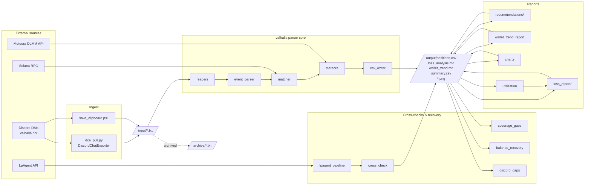
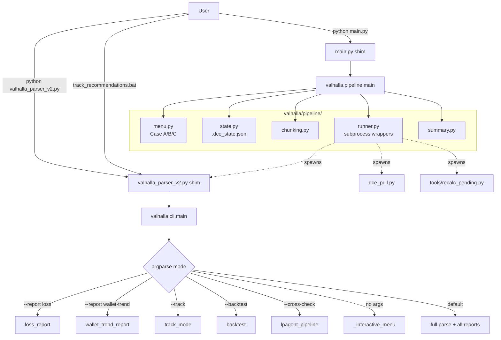
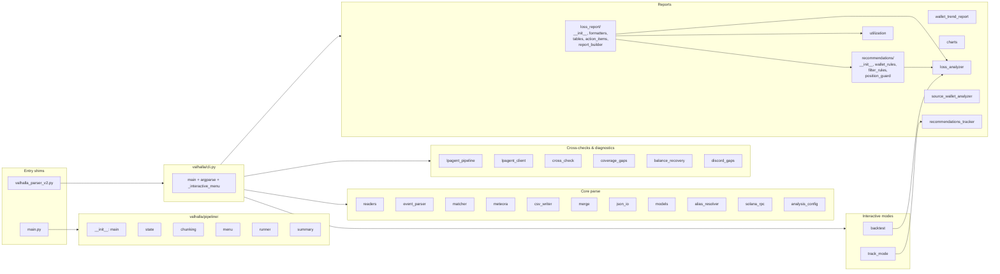

# Valhalla Fjorge — Architecture

Target architecture **post-refactor** (after design docs 014–022 are implemented).
For the current state during implementation, run `git log --oneline` to see how far the refactor has progressed.

---

## 1. End-to-end Pipeline

How data flows from Discord through the parser to final reports.

### Mermaid



### ASCII

```
                                External
   +-------------+         +-----------------+         +------------+
   | Discord DMs |         |  LpAgent API    |         |  Meteora   |
   |  (Valhalla) |         | (cross-check)   |         |  DLMM API  |
   +------+------+         +--------+--------+         +-----+------+
          |                         |                        |
          v                         |                        |
   +------+-----------+             |                        |
   | dce_pull.py      |             |                        |
   | save_clipboard   |             |                        |
   +------+-----------+             |                        |
          |                         |                        |
          v                         |                        |
   +------+----------+              |                        |
   |   input/*.txt   |              |                        |
   +------+----------+              |                        |
          |                         |                        |
          v                         v                        |
   +------+--------------------------------------------------+--------+
   |                       valhalla parser                            |
   |                                                                  |
   |   readers --> event_parser --> matcher --> meteora --> csv_writer|
   |                                   ^                              |
   |                                   |                              |
   |                              Solana RPC                          |
   |                                                                  |
   |   lpagent_pipeline --> cross_check                               |
   |   coverage_gaps     |  balance_recovery  |  discord_gaps         |
   +------+-----------------------------------------------------------+
          |
          v
   +------+--------------------------------------------------------+
   |                        output/                                 |
   |   positions.csv  | summary.csv  | skip_events.csv               |
   |   insufficient_balance.csv | address_cache.json                 |
   +------+-----------------------------------------------------+--+
          |                                                     |
          v                                                     v
   +------+--------------------+                  +-------------+--+
   |  Reports (post-process)   |                  |   Charts       |
   |                           |                  |                |
   |  loss_report/             |                  | daily_pnl.png  |
   |  recommendations/         |                  | rolling_3d.png |
   |  wallet_trend_report      |                  | utilization    |
   |  utilization              |                  | filter_impact  |
   +------+--------------------+                  +-------------+--+
          |
          v
   +------+----------------------+
   |  output/loss_analysis.md    |
   |  output/wallet_trend.md     |
   +-----------------------------+

  archive/ <-- input/*.txt are moved here after successful parse
```

---

## 2. CLI Dispatch

Two entry-point shims, one orchestrator each.

### Mermaid



### ASCII

```
  User
   |
   +---> python main.py
   |        |
   |        v
   |   main.py shim (UTF-8 setup, ~30 lines)
   |        |
   |        v
   |   valhalla.pipeline.main()
   |        |
   |        +-- pipeline/menu.py    (Case A: first run | B: recent | C: stale)
   |        +-- pipeline/state.py   (.dce_state.json)
   |        +-- pipeline/chunking.py (day-by-day)
   |        +-- pipeline/runner.py  --[subprocess]--> dce_pull.py
   |        |                       --[subprocess]--> valhalla_parser_v2.py
   |        |                       --[subprocess]--> tools/recalc_pending.py
   |        +-- pipeline/summary.py
   |
   +---> python valhalla_parser_v2.py [args]
   |       (or track_recommendations.bat)
            |
            v
       valhalla_parser_v2.py shim (~30 lines)
            |
            v
       valhalla.cli.main()
            |
            +-- argparse dispatch:
            |     --report loss          --> loss_report/
            |     --report wallet-trend  --> wallet_trend_report
            |     --report recommendations --> recommendations/
            |     --track                --> track_mode
            |     --backtest             --> backtest
            |     --cross-check DATE     --> lpagent_pipeline
            |     (no args)              --> _interactive_menu()
            |     (default)              --> full parse + all reports
```

---

## 3. Module Map (post-refactor)

The `valhalla/` package after docs 014–022 are implemented.

### Mermaid



### ASCII

```
  ENTRY SHIMS                           Lines
  -----------                           -----
  main.py                                ~30
  valhalla_parser_v2.py                  ~30

  valhalla/                              Lines
  ---------                              -----
  __init__.py                              5
  cli.py                                 ~700  (was main() in parser, doc 020)
  analysis_config.py                     143

  valhalla/pipeline/   (doc 021)
    __init__.py            (main)        ~30
    state.py                              ~50
    chunking.py                           ~50
    menu.py                              ~200
    runner.py                            ~250
    summary.py                            ~50

  valhalla/loss_report/   (doc 018)
    __init__.py                           ~10
    formatters.py                         ~50
    tables.py                            ~150
    action_items.py                      ~200
    report_builder.py                    ~250

  valhalla/recommendations/   (doc 017)
    __init__.py                           ~10
    wallet_rules.py                      ~250  (Rules A, B, C, F)
    filter_rules.py                      ~150  (Rule D)
    position_guard.py                     ~50

  Cross-checks & diagnostics                   Source
  --------------------------                   ------
  lpagent_pipeline.py     (doc 015)            extracted from parser
  lpagent_client.py                            existing
  cross_check.py                               existing
  coverage_gaps.py        (doc 016)            extracted from parser
  balance_recovery.py     (doc 016)            extracted from parser
  discord_gaps.py                              existing

  Core parse                                   Status
  ----------                                   ------
  readers.py                                   existing, OK as-is
  event_parser.py            584 lines         keep (per doc 022)
  matcher.py                 757 lines         keep (per doc 022)
  meteora.py                 260 lines         existing
  merge.py                   633 lines         keep (per doc 022)
  csv_writer.py              428 lines         existing
  json_io.py                 262 lines         existing
  models.py                  297 lines         existing
  alias_resolver.py           87 lines         existing
  solana_rpc.py              197 lines         existing

  Reports / analysis                           Status
  ------------------                           ------
  charts.py                 1500 lines         keep (per doc 022)
  loss_analyzer.py          1096 lines         keep (per doc 022)
  utilization.py             231 lines         existing
  source_wallet_analyzer.py  337 lines         existing
  recommendations_tracker.py 268 lines         existing
  wallet_trend_report.py     240 lines         existing

  Interactive modes                            Source
  -----------------                            ------
  backtest.py             (doc 019)            extracted from parser
  track_mode.py           (doc 019)            extracted from parser

  Verification (not in valhalla/)              Source
  -------------------------------              ------
  tests/verify_baseline.py  (doc 014)          new — diffs vs _baseline_pre_refactor/
```

---

## Notes

- **Doc 022 explicitly decided NOT to split** `charts.py`, `loss_analyzer.py`, `matcher.py`, `merge.py`, `event_parser.py` despite their size — each is a coherent single-domain module. See `docs/022-valhalla-package-review.md` for the rationale.
- **`tools/`** scripts (`recalc_pending.py`, `compare_positions.py`, `cross_reference.py`, `discord_gaps.py`, etc.) are standalone utilities invoked manually or by `pipeline/runner.py`. They import from `valhalla/` but are not part of the package.
- **`web/`** (Next.js TypeScript port) is gitignored and out of scope for the Python refactor.
